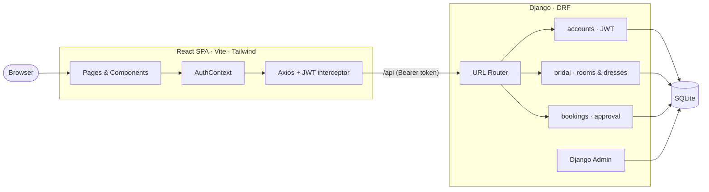
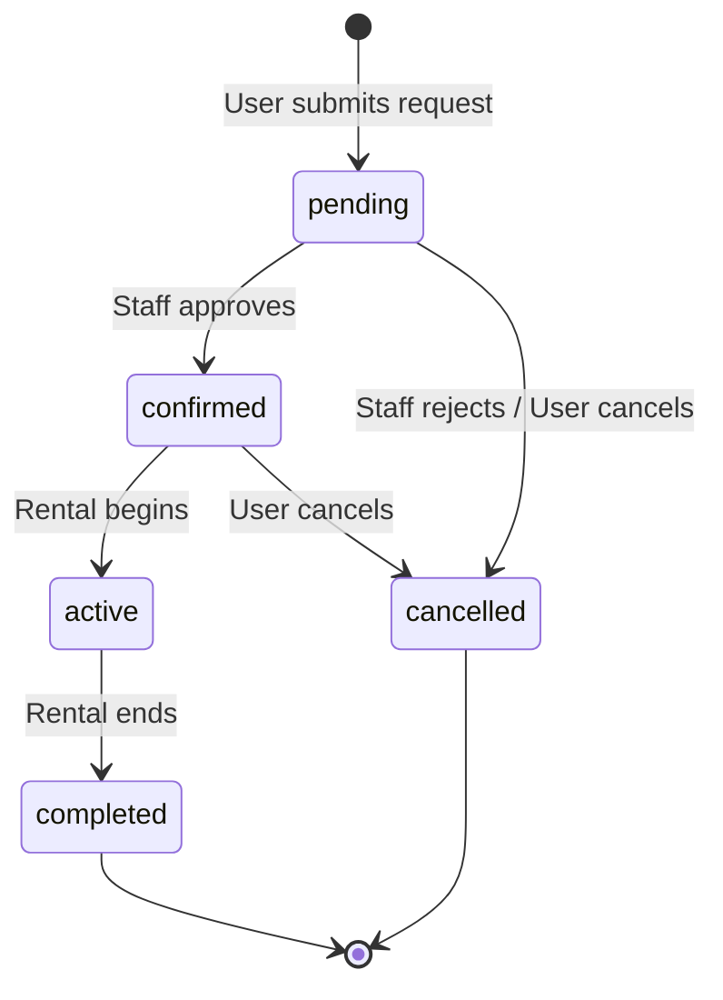

<div align="center">

# 💍 Bridal Room & Dress Rental System

**A full‑stack rental management platform for bridal rooms and dresses, with a request‑and‑approval booking workflow.**

Built with a **Django REST Framework** API and a **React + Vite + Tailwind CSS** single‑page application.

[](https://www.djangoproject.com/)
[](https://www.django-rest-framework.org/)
[](https://react.dev/)
[](https://vite.dev/)
[](https://tailwindcss.com/)
[](https://jwt.io/)
[](https://www.docker.com/)

</div>

---

## 📖 Table of Contents

- [Overview](#-overview)
- [Key Features](#-key-features)
- [Tech Stack](#-tech-stack)
- [Architecture](#-architecture)
- [Project Structure](#-project-structure)
- [Getting Started](#-getting-started)
  - [Option A — Local Development](#option-a--local-development-recommended-for-coding)
  - [Option B — Docker Compose](#option-b--docker-compose-full-stack)
- [Configuration](#-configuration)
- [API Overview](#-api-overview)
- [Booking Workflow](#-booking-workflow)
- [Documentation](#-documentation)
- [Contributing](#-contributing)
- [License](#-license)

---

## 🌸 Overview

The **Bridal Room & Dress Rental System** lets customers browse available bridal rooms and dresses, request bookings for a chosen date range, and track the status of those requests. Staff members review incoming requests from a dedicated admin panel (or the Django admin) and **approve** or **reject** them. Prices are calculated automatically on the server from each item's rate and the requested duration.

The project is split into a stateless JSON API (Django REST Framework) and a decoupled React client that consumes it. The two can run independently in development (Vite dev server proxying to Django) or be composed together behind Nginx in production.

> **Context:** This application was built as a database‑management coursework project (ADBMS). It is intended for learning and demonstration.

---

## ✨ Key Features

| Area | Highlights |
|------|-----------|
| 🔐 **Authentication** | Email + password sign‑in, JWT access/refresh tokens, automatic silent token refresh, per‑tab sessions |
| 🏛️ **Rooms** | Browse and filter bridal rooms by availability; per‑hour pricing; capacity, location & amenities |
| 👗 **Dresses** | Browse and filter dresses by status and category; per‑day pricing with a refundable deposit; size & color |
| 📅 **Bookings** | Request a room *or* dress for a date range; server‑side price calculation; full status lifecycle |
| ✅ **Approval Workflow** | Requests start as `pending`; staff approve → `confirmed` or reject → `cancelled` |
| 🛡️ **Role‑Based Access** | Public browsing, authenticated bookings, staff‑only management — enforced by DRF permissions and React route guards |
| 🧑‍💼 **Admin** | Custom React admin panel **and** a themed Django admin with bulk approve/reject actions |
| 👤 **Profiles** | Editable phone, address & avatar (multipart upload) |
| 📚 **Self‑Documenting API** | Interactive Swagger UI and ReDoc generated from the live schema |
| 🎨 **Polished UI** | Elegant ivory/blush/champagne‑gold bridal theme, responsive layout, live price estimates |

---

## 🛠 Tech Stack

| Layer | Technologies |
|-------|--------------|
| **Backend** | Python, Django (4.2+), Django REST Framework |
| **Auth** | `djangorestframework-simplejwt` (Bearer access + refresh tokens) |
| **API Docs** | `drf-spectacular` (OpenAPI 3 → Swagger UI / ReDoc) |
| **Frontend** | React 19, React Router 7, Vite 8, Tailwind CSS 4, Axios |
| **Database** | SQLite (default; swappable for PostgreSQL) |
| **Static/Media** | WhiteNoise (compressed static), Pillow (image handling) |
| **Server** | Gunicorn (WSGI) |
| **Infra** | Docker, Docker Compose, Nginx (reverse proxy) |

---

## 🏗 Architecture



In production, an **Nginx reverse proxy** sits in front of both tiers: it serves the built React assets, forwards `/api` and `/admin` to Django (Gunicorn), and serves `/media` and `/static` from shared volumes. See [docs/ARCHITECTURE.md](docs/ARCHITECTURE.md) for the full picture.

---

## 📁 Project Structure

```
bridal-room-rental/
├── config/                 # Django project (settings, root URLs, WSGI/ASGI)
├── accounts/               # Custom User model, JWT auth, registration & profile
├── bridal/                 # Category, BridalRoom, BridalDress — models, viewsets, admin
├── bookings/               # Booking model, approval workflow, price calculation
├── frontend/               # React + Vite + Tailwind SPA (and Django SPA fallback)
│   ├── src/
│   │   ├── api/            # Axios instance + JWT request/refresh interceptors
│   │   ├── context/        # AuthContext (login, register, profile, logout)
│   │   ├── components/     # Navbar, Footer, route guards (Protected/Admin/Guest)
│   │   └── pages/          # Landing, Login, Register, Dashboard, Rooms, Dresses,
│   │                       # Bookings, EditProfile, AdminPanel
│   ├── templates/          # react-index.html (served by Django when DEBUG=False)
│   └── vite.config.js      # Dev proxy: /api, /admin, /media → Django
├── docs/                   # 📚 Full project documentation (see below)
├── media/                  # Uploaded images (avatars, rooms, dresses)
├── docker-compose.yml      # Production stack: Django + React + Nginx
├── docker-compose.dev.yml  # Lightweight Django-only dev container
├── Dockerfile              # Django image (Gunicorn)
├── Dockerfile.react        # React build → Nginx image
├── nginx.conf              # Reverse-proxy routing
├── entrypoint.sh           # migrate → collectstatic → gunicorn
└── requirements.txt        # Python dependencies
```

---

## 🚀 Getting Started

### Prerequisites

- **Python** 3.11+
- **Node.js** 18+ and npm
- *(optional)* **Docker** & Docker Compose for the containerized stack

### Option A — Local Development (recommended for coding)

Run the API and the SPA as two processes with hot reload.

**1. Backend (Django API)**

```bash
# from the repository root
python -m venv venv
source venv/bin/activate          # Windows: venv\Scripts\activate

pip install -r requirements.txt
python manage.py migrate
python manage.py createsuperuser  # create your own admin login
python manage.py runserver        # → http://localhost:8000
```

**2. Frontend (React SPA)** — in a second terminal:

```bash
cd frontend
npm install
npm run dev                       # → http://localhost:5173
```

The Vite dev server proxies `/api`, `/admin`, and `/media` to Django on port `8000`, so you only need to open **http://localhost:5173**.

| URL | What it serves |
|-----|----------------|
| http://localhost:5173 | React app (with hot reload) |
| http://localhost:8000/admin/ | Django admin panel |
| http://localhost:8000/api/docs/ | Swagger UI (interactive API) |
| http://localhost:8000/api/redoc/ | ReDoc API reference |

### Option B — Docker Compose (full stack)

Brings up Django (Gunicorn), the built React app, and an Nginx reverse proxy.

```bash
docker compose up --build -d
docker compose exec backend python manage.py createsuperuser
```

Then open **http://localhost:8090** (the Nginx entry point).

| Service | Container | Host Port |
|---------|-----------|-----------|
| `nginx` | reverse proxy (main entry) | **8090** |
| `backend` | Django + Gunicorn | 8002 |
| `frontend` | Nginx serving the React build | 3001 |

For a quick Django‑only container with live reload, use the dev compose file:

```bash
docker compose -f docker-compose.dev.yml up --build   # → http://localhost:8000
```

> See [docs/DEPLOYMENT.md](docs/DEPLOYMENT.md) for the full deployment guide, including the single‑server “Django serves the SPA” mode.

---

## ⚙️ Configuration

The backend is configured via environment variables (sensible development defaults apply if unset):

| Variable | Default | Description |
|----------|---------|-------------|
| `DEBUG` | `True` | `False` in production — enables the SPA catch‑all route and WhiteNoise static serving |
| `SECRET_KEY` | *(insecure dev key)* | **Must** be overridden in production |
| `DJANGO_ALLOWED_HOSTS` | `*` | Comma‑separated list of allowed hosts |
| `PYTHONUNBUFFERED` | — | Set to `1` in containers for unbuffered logs |

Key defaults baked into `config/settings.py`:

- **JWT lifetimes** — access token: **1 day**, refresh token: **7 days**
- **Pagination** — `PageNumberPagination`, **20** items per page
- **CORS** — all origins allowed (development convenience; tighten for production)
- **Database** — SQLite at `db.sqlite3` (swap `DATABASES` for PostgreSQL if desired)

---

## 📡 API Overview

Base path: **`/api`** · Auth: **`Authorization: Bearer <access_token>`**

| Method | Endpoint | Auth | Description |
|--------|----------|------|-------------|
| `POST` | `/api/auth/register/` | Public | Create an account |
| `POST` | `/api/auth/login/` | Public | Obtain JWT tokens (email + password) |
| `POST` | `/api/auth/token/refresh/` | Public | Refresh an access token |
| `GET` `PUT` `PATCH` | `/api/auth/profile/` | User | View / update own profile |
| `GET` `POST` | `/api/categories/` | Read public · Write staff | Dress categories |
| `GET` `POST` | `/api/rooms/` | Read public · Write staff | Bridal rooms (`?status=`) |
| `GET` `POST` | `/api/dresses/` | Read public · Write staff | Bridal dresses (`?status=`, `?category=`) |
| `GET` `POST` | `/api/bookings/` | User | List own bookings / create a request |
| `POST` | `/api/bookings/{id}/cancel/` | Owner | Cancel a pending/confirmed booking |
| `POST` | `/api/bookings/{id}/approve/` | Staff | Approve a pending booking |
| `POST` | `/api/bookings/{id}/reject/` | Staff | Reject a pending booking |

Interactive docs are available at **`/api/docs/`** (Swagger) and **`/api/redoc/`** (ReDoc). The full, example‑rich reference lives in [docs/API_REFERENCE.md](docs/API_REFERENCE.md).

---

## 🔄 Booking Workflow



When a booking is created, the server computes `total_price` automatically:

- **Rooms** → `price_per_hour × hours` (minimum 1 hour)
- **Dresses** → `rental_price_per_day × days` (minimum 1 day) `+ deposit_amount`

---

## 📚 Documentation

In‑depth guides live in the [`docs/`](docs/) directory:

| Document | Contents |
|----------|----------|
| [Architecture](docs/ARCHITECTURE.md) | System design, request lifecycle, deployment topology |
| [API Reference](docs/API_REFERENCE.md) | Every endpoint with request/response examples & error cases |
| [Data Model](docs/DATA_MODEL.md) | Entity‑relationship diagram and field‑by‑field schema |
| [Setup Guide](docs/SETUP.md) | Detailed local environment setup & common commands |
| [Deployment Guide](docs/DEPLOYMENT.md) | Docker, Nginx, and single‑server production modes |
| [Frontend Guide](docs/FRONTEND.md) | React app structure, routing, auth flow & state |
| [Contributing](docs/CONTRIBUTING.md) | Conventions, workflow, and how to propose changes |

---

## 🤝 Contributing

Contributions are welcome. Please read the [Contributing Guide](docs/CONTRIBUTING.md) for branch naming, commit conventions, and the pull‑request process. In short: branch from `main`, keep changes focused, and describe the *why* in your PR.

---

## 📄 License

No license file is currently included. This project was created for academic/educational purposes; if you intend to reuse it, please add an appropriate license (e.g. [MIT](https://choosealicense.com/licenses/mit/)) and check with the author first.

---

<div align="center">

Built with ❤️ using **Django** & **React**.

</div>
