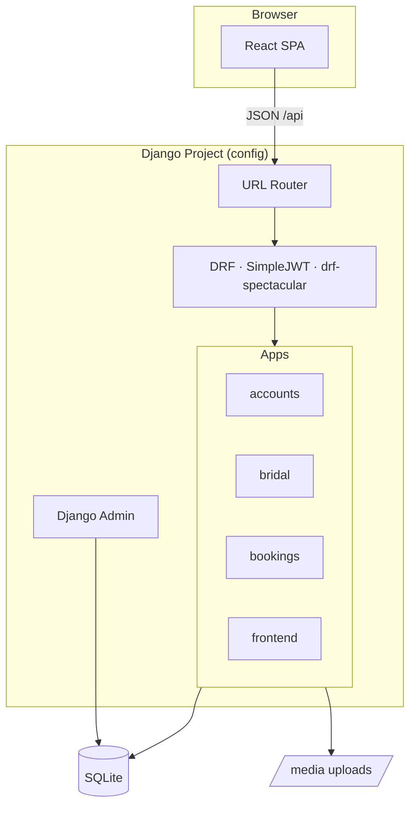
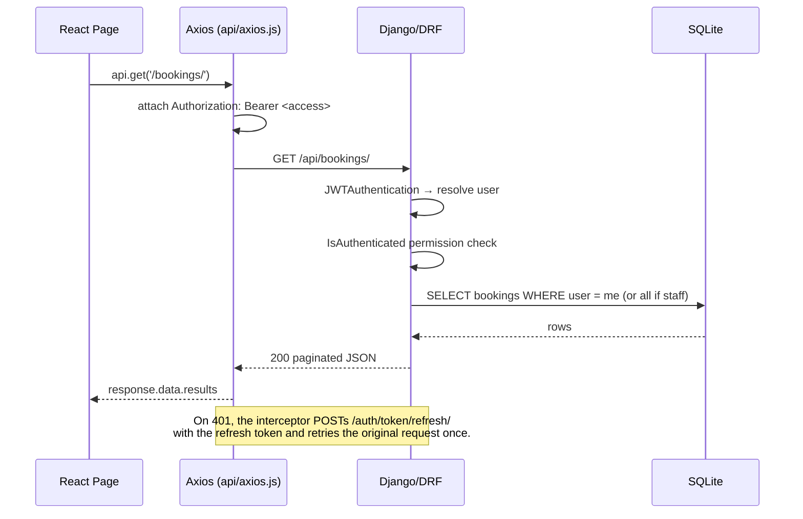
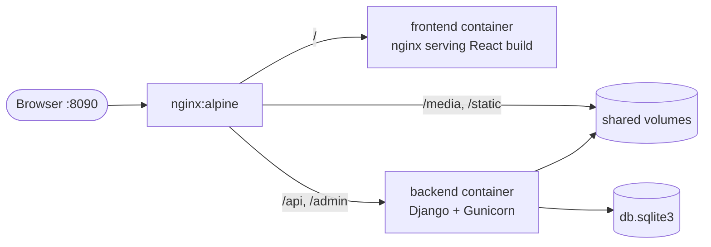

# Architecture

This document describes how the **Bridal Room & Dress Rental System** is structured, how a request flows through it, and how the pieces are deployed.

- [System Overview](#system-overview)
- [Backend Layout (Django)](#backend-layout-django)
- [Frontend Layout (React)](#frontend-layout-react)
- [Request Lifecycle](#request-lifecycle)
- [Authentication & Tokens](#authentication--tokens)
- [Authorization Model](#authorization-model)
- [Deployment Topology](#deployment-topology)
- [Design Decisions](#design-decisions)

---

## System Overview

The application is a **decoupled two‑tier system**:

| Tier | Responsibility | Technology |
|------|----------------|------------|
| **API** | Persistence, business rules, auth, admin | Django + Django REST Framework |
| **Client** | Presentation, routing, state, forms | React (Vite) SPA |

The client communicates with the API exclusively over JSON at `/api`, authenticating with a JWT Bearer token. There is no server‑rendered HTML in the user flow except the single `react-index.html` shell that boots the SPA (used only in the single‑server deployment mode).



---

## Backend Layout (Django)

The Django project is named **`config`** and is composed of four apps:

| App | Purpose | Key Models | Key Endpoints |
|-----|---------|-----------|---------------|
| **`accounts`** | Custom user, registration, JWT login, profile | `User` | `/api/auth/...` |
| **`bridal`** | Inventory of rooms & dresses | `Category`, `BridalRoom`, `BridalDress` | `/api/rooms/`, `/api/dresses/`, `/api/categories/` |
| **`bookings`** | Booking requests & approval workflow | `Booking` | `/api/bookings/...` |
| **`frontend`** | Serves the built SPA shell when `DEBUG=False` | — | catch‑all `^.*$` |

**Cross‑cutting configuration** lives in [`config/settings.py`](../config/settings.py):

- `AUTH_USER_MODEL = "accounts.User"` — email is the login field.
- DRF defaults: `JWTAuthentication`, `IsAuthenticated`, `PageNumberPagination` (page size 20).
- `drf-spectacular` powers the OpenAPI schema and the Swagger/ReDoc UIs.
- WhiteNoise serves compressed static files; `corsheaders` allows cross‑origin calls from the SPA.

URL composition ([`config/urls.py`](../config/urls.py)):

```
/admin/                → Django admin
/api/auth/             → accounts.urls
/api/                  → bridal.urls (categories, rooms, dresses routers)
/api/bookings/         → bookings.urls
/api/schema/           → OpenAPI schema
/api/docs/             → Swagger UI
/api/redoc/            → ReDoc
/  (only DEBUG=False)  → frontend.urls (SPA fallback)
```

---

## Frontend Layout (React)

The SPA lives in [`frontend/`](../frontend) and is built with Vite. It is organized by responsibility:

```
src/
├── api/axios.js        # Axios instance + JWT request & 401-refresh interceptors
├── context/AuthContext # Global auth state: user, login, register, updateProfile, logout
├── components/         # Navbar, Footer + route guards
│   ├── ProtectedRoute  # requires an authenticated user
│   ├── AdminRoute      # requires user.is_staff
│   └── GuestRoute      # only for logged-out users (login/register)
└── pages/              # One component per route (see docs/FRONTEND.md)
```

State management is intentionally lightweight: a single React **Context** (`AuthContext`) holds the authenticated user and exposes auth actions. Everything else is local component state fed by API calls. See [FRONTEND.md](FRONTEND.md) for the full routing map and page responsibilities.

---

## Request Lifecycle

A typical authenticated API call — e.g. listing the current user's bookings:



---

## Authentication & Tokens

- **Login** (`POST /api/auth/login/`) accepts **email + password** and returns an `access` and a `refresh` token (SimpleJWT).
- The SPA stores both tokens in **`sessionStorage`**, so each browser tab keeps an independent session (useful for testing a customer and an admin side by side).
- Every API request attaches `Authorization: Bearer <access>` via an Axios request interceptor.
- On a `401`, a response interceptor transparently calls `/api/auth/token/refresh/`, stores the new access token, and replays the original request **once**. If refresh fails, the session is cleared and the user is redirected to `/login`.
- Token lifetimes: **access = 1 day**, **refresh = 7 days**.

---

## Authorization Model

Permissions are enforced on **both** tiers — the API is the source of truth; the SPA mirrors it for UX.

| Resource | Read | Write / Manage |
|----------|------|----------------|
| Categories, Rooms, Dresses | Public (anyone) | Staff only (`IsStaffOrReadOnly`) |
| Bookings (list/create/detail) | Authenticated; users see only their own, staff see all | Authenticated owner |
| Booking `approve` / `reject` | — | Staff only (`IsAdminUser`) |
| Booking `cancel` | — | Authenticated owner (status must be `pending`/`confirmed`) |
| Profile | Authenticated (own) | Authenticated (own — phone/address/avatar only) |
| Registration | Public | Public |

On the client, the same rules are reflected by route guards: `ProtectedRoute` (any signed‑in user), `AdminRoute` (`is_staff`), and `GuestRoute` (signed‑out only).

---

## Deployment Topology

The repository supports two production shapes.

### Mode 1 — Docker Compose (three containers)

This is what [`docker-compose.yml`](../docker-compose.yml) builds. Nginx is the single public entry point.



- **nginx** (`:8090`) routes by path: `/` → React, `/api` & `/admin` → Django, `/media` & `/static` → shared volumes.
- **backend** runs `entrypoint.sh`: `migrate` → `collectstatic` → `gunicorn`. Runs with `DEBUG=False`.
- **frontend** is a multi‑stage build (`Dockerfile.react`): `npm run build` → static files served by its own Nginx.

### Mode 2 — Single Django server

Django serves the SPA itself (no separate React container). Build the SPA into Django's static dir and run with `DEBUG=False`:

```bash
cd frontend && npm run build:django   # → ../static/react-assets + templates/react-index.html
```

With `DEBUG=False`, `config/urls.py` mounts `frontend.urls`, whose catch‑all renders `react-index.html`; WhiteNoise serves the hashed assets from `/static/react-assets/`.

See [DEPLOYMENT.md](DEPLOYMENT.md) for step‑by‑step instructions on both modes.

---

## Design Decisions

| Decision | Rationale |
|----------|-----------|
| **Custom `User` with email login** | Email is a more natural identifier than a username for a consumer app; `is_verified` leaves room for an email‑verification flow. |
| **Server‑side price calculation** | Prevents clients from tampering with `total_price`; pricing rules live in one place (`BookingCreateSerializer`). |
| **Separate create vs. read serializers for bookings** | The create payload is minimal (item + dates + notes); the read representation is enriched (status, price, related names). |
| **`sessionStorage` for tokens** | Per‑tab isolation simplifies demoing different roles; trades persistence across tabs for clarity. |
| **`SET_NULL` on room/dress foreign keys** | Deleting an inventory item preserves historical bookings rather than cascading them away. |
| **JWT over session auth** | Keeps the API stateless and the React client fully decoupled. |
| **Two deployment modes** | Compose mode mirrors a realistic multi‑service deployment; single‑server mode is simpler for small hosts and demos. |

---

**See also:** [API Reference](API_REFERENCE.md) · [Data Model](DATA_MODEL.md) · [Frontend Guide](FRONTEND.md) · [Deployment](DEPLOYMENT.md)
