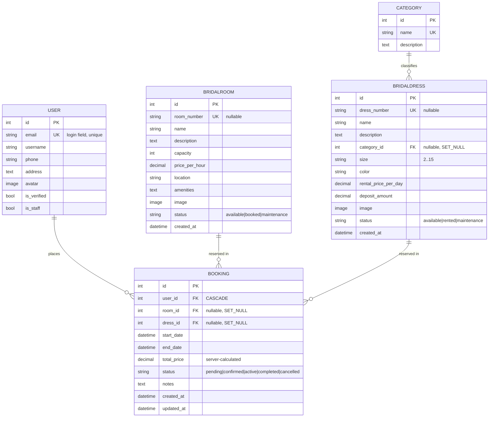

# Data Model

The schema for the Bridal Room & Dress Rental System, derived from the Django models in [`accounts`](../accounts/models.py), [`bridal`](../bridal/models.py), and [`bookings`](../bookings/models.py).

- [Entity‑Relationship Diagram](#entityrelationship-diagram)
- [User](#user-accounts)
- [Category](#category-bridal)
- [BridalRoom](#bridalroom-bridal)
- [BridalDress](#bridaldress-bridal)
- [Booking](#booking-bookings)
- [Relationships & Delete Behavior](#relationships--delete-behavior)

---

## Entity‑Relationship Diagram



> A booking references **either** a room **or** a dress (enforced at the serializer level, not by a DB constraint).

---

## `User` (accounts)

Extends Django's `AbstractUser`; **email is the login identifier** (`USERNAME_FIELD = "email"`).

| Field | Type | Notes |
|-------|------|-------|
| `id` | BigAutoField | Primary key |
| `email` | EmailField | **Unique**, used to log in |
| `username` | CharField | Required (`REQUIRED_FIELDS`), inherited |
| `password` | CharField | Hashed; write‑only in the API |
| `phone` | CharField(15) | Optional |
| `address` | TextField | Optional |
| `avatar` | ImageField | Optional, uploaded to `media/avatars/` |
| `is_verified` | BooleanField | Default `False` (reserved for email verification) |
| `is_staff` | BooleanField | Grants admin/management access |
| `is_superuser`, `is_active`, `date_joined`, … | — | Inherited from `AbstractUser` |

**API exposure:** registration accepts `username, email, password, phone, address`. The profile endpoint exposes `id, username, email, phone, address, avatar, is_verified, is_staff` but only `phone, address, avatar` are writable.

---

## `Category` (bridal)

Classifies dresses (e.g. *Mermaid*, *A‑Line*, *Ball Gown*).

| Field | Type | Notes |
|-------|------|-------|
| `id` | BigAutoField | Primary key |
| `name` | CharField(100) | **Unique** |
| `description` | TextField | Optional |

---

## `BridalRoom` (bridal)

A bookable room, priced **per hour**.

| Field | Type | Notes |
|-------|------|-------|
| `id` | BigAutoField | Primary key |
| `room_number` | CharField(20) | Unique, optional inventory identifier |
| `name` | CharField(200) | Display name |
| `description` | TextField | Required |
| `capacity` | IntegerField | Maximum guests |
| `price_per_hour` | DecimalField(10,2) | Hourly rate |
| `location` | CharField(255) | Where the room is |
| `amenities` | TextField | Comma‑separated list, optional |
| `image` | ImageField | Optional, `media/rooms/` |
| `status` | CharField | `available` · `booked` · `maintenance` (default `available`) |
| `created_at` | DateTimeField | Auto, newest first |

---

## `BridalDress` (bridal)

A rentable dress, priced **per day** with a refundable deposit.

| Field | Type | Notes |
|-------|------|-------|
| `id` | BigAutoField | Primary key |
| `dress_number` | CharField(20) | Unique, optional inventory identifier |
| `name` | CharField(200) | Display name |
| `description` | TextField | Required |
| `category` | FK → `Category` | `SET_NULL` on delete; `related_name="dresses"` |
| `size` | CharField | Choices `"2"`–`"15"` |
| `color` | CharField(50) | — |
| `rental_price_per_day` | DecimalField(10,2) | Daily rate |
| `deposit_amount` | DecimalField(10,2) | Refundable; default `0` |
| `image` | ImageField | Optional, `media/dresses/` |
| `status` | CharField | `available` · `rented` · `maintenance` (default `available`) |
| `created_at` | DateTimeField | Auto, newest first |

---

## `Booking` (bookings)

A reservation request linking a user to a room **or** a dress for a date range.

| Field | Type | Notes |
|-------|------|-------|
| `id` | BigAutoField | Primary key |
| `user` | FK → `User` | `CASCADE`; `related_name="bookings"` |
| `room` | FK → `BridalRoom` | Nullable, `SET_NULL`; `related_name="bookings"` |
| `dress` | FK → `BridalDress` | Nullable, `SET_NULL`; `related_name="bookings"` |
| `start_date` | DateTimeField | Rental start |
| `end_date` | DateTimeField | Rental end (must be after start) |
| `total_price` | DecimalField(10,2) | **Computed server‑side** on create |
| `status` | CharField | `pending` · `confirmed` · `active` · `completed` · `cancelled` (default `pending`) |
| `notes` | TextField | Optional |
| `created_at` | DateTimeField | Auto |
| `updated_at` | DateTimeField | Auto, updates on save |

**Price calculation** (in `BookingCreateSerializer`):

```
hours = (end_date - start_date) in hours
room  → price_per_hour       × max(1, hours)
dress → rental_price_per_day × max(1, hours / 24) + deposit_amount
```

---

## Relationships & Delete Behavior

| Relationship | Cardinality | On delete |
|--------------|-------------|-----------|
| `User` → `Booking` | one‑to‑many | **CASCADE** — deleting a user deletes their bookings |
| `Category` → `BridalDress` | one‑to‑many | **SET_NULL** — deleting a category leaves dresses uncategorized |
| `BridalRoom` → `Booking` | one‑to‑many | **SET_NULL** — deleting a room keeps the historical booking |
| `BridalDress` → `Booking` | one‑to‑many | **SET_NULL** — deleting a dress keeps the historical booking |

The `SET_NULL` choices on `Booking.room` / `Booking.dress` deliberately preserve booking history even after inventory is removed.

---

**See also:** [API Reference](API_REFERENCE.md) · [Architecture](ARCHITECTURE.md)
