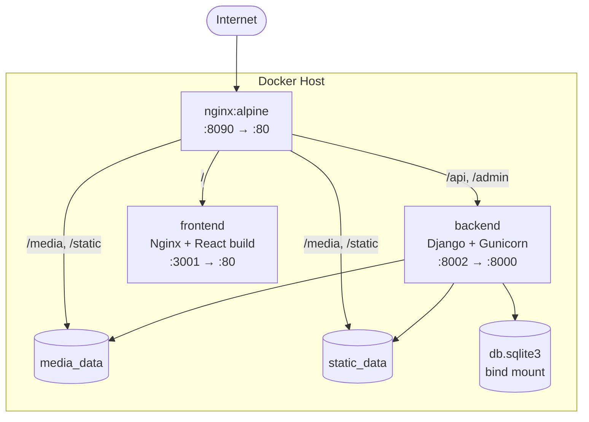

# Deployment Guide

How to run the Bridal Room & Dress Rental System in production. Three modes are supported, from a full multi‑container stack to a single Django process.

- [Mode 1 — Docker Compose (recommended)](#mode-1--docker-compose-recommended)
- [Mode 2 — Docker (development container)](#mode-2--docker-development-container)
- [Mode 3 — Single Django server (SPA served by Django)](#mode-3--single-django-server-spa-served-by-django)
- [Production Checklist](#production-checklist)
- [How the pieces fit](#how-the-pieces-fit)

---

## Mode 1 — Docker Compose (recommended)

Builds three containers — Django (Gunicorn), the compiled React app, and an Nginx reverse proxy — wired together with shared volumes. Defined in [`docker-compose.yml`](../docker-compose.yml).

### Run it

```bash
docker compose up --build -d
docker compose exec backend python manage.py createsuperuser
```

Open **http://localhost:8090**.

### Services & ports

| Service | Image / Build | Container port | Host port | Role |
|---------|---------------|----------------|-----------|------|
| `nginx` | `nginx:alpine` | 80 | **8090** | Public entry point / reverse proxy |
| `backend` | `Dockerfile` | 8000 | 8002 | Django + Gunicorn API |
| `frontend` | `Dockerfile.react` | 80 | 3001 | Nginx serving the React build |

> The `backend` and `frontend` host ports (`8002`, `3001`) are exposed for direct debugging. In normal use, everything goes through **nginx on `8090`**.

### What happens on `up`

1. **backend** builds from `Dockerfile`, then runs [`entrypoint.sh`](../entrypoint.sh):
   `migrate --noinput` → `collectstatic --noinput` → `gunicorn config.wsgi`. It runs with `DEBUG=False`.
2. **frontend** builds from `Dockerfile.react` (multi‑stage): `npm ci && npm run build`, then copies `dist/` into an Nginx image.
3. **nginx** mounts [`nginx.conf`](../nginx.conf) and the shared `media`/`static` volumes, and routes traffic.

### Request routing (nginx.conf)

| Path | Upstream |
|------|----------|
| `/media/` | shared `media` volume (cached 7d) |
| `/static/` | shared `static` volume (cached 30d) |
| `/api/` | `backend:8000` (Django) |
| `/admin/` | `backend:8000` (Django) |
| `/` (everything else) | `frontend:80` (React), with SPA fallback to `index.html` |

### Managing the stack

```bash
docker compose logs -f                 # tail logs
docker compose ps                      # service status
docker compose exec backend sh         # shell into Django
docker compose down                    # stop & remove containers
docker compose down -v                 # also remove media/static volumes
```

> **Persistence:** `db.sqlite3` is bind‑mounted from the host, and `media_data` / `static_data` are named volumes. Your data survives `docker compose down` (but `-v` deletes the volumes — the SQLite file on the host remains).

---

## Mode 2 — Docker (development container)

A single lightweight Django container with live code mounting and `DEBUG=True`, defined in [`docker-compose.dev.yml`](../docker-compose.dev.yml). Useful for running the API in Docker while developing the frontend on the host.

```bash
docker compose -f docker-compose.dev.yml up --build
```

- Mounts the project directory into the container (live reload).
- Runs `migrate` then `runserver 0.0.0.0:8000`.
- Exposes Django on **http://localhost:8000**.

Run the React dev server on the host as usual (`cd frontend && npm run dev`).

---

## Mode 3 — Single Django server (SPA served by Django)

No separate React container — Django serves the compiled SPA itself via WhiteNoise. Good for a simple single‑process host.

### 1. Build the SPA into Django's static directory

```bash
cd frontend
npm install
npm run build:django
```

This script (see [`frontend/package.json`](../frontend/package.json)) builds with base `/static/react-assets/`, writes the assets to `../static/react-assets/`, and copies the generated `index.html` to `frontend/templates/react-index.html`.

### 2. Collect static and run with DEBUG off

```bash
cd ..
export DEBUG=False
export SECRET_KEY="<a-long-random-secret>"
export DJANGO_ALLOWED_HOSTS="yourdomain.com"

python manage.py migrate
python manage.py collectstatic --noinput
gunicorn config.wsgi:application --bind 0.0.0.0:8000
```

With `DEBUG=False`, [`config/urls.py`](../config/urls.py) mounts `frontend.urls`, whose catch‑all route (`^.*$`) renders `react-index.html` for any non‑API path. WhiteNoise serves the hashed `/static/react-assets/` files. The SPA's client‑side router then takes over.

> In this mode, point your external web server / load balancer at Gunicorn on port `8000`.

---

## Production Checklist

Before exposing the app publicly, address the development defaults in [`config/settings.py`](../config/settings.py):

- [ ] **`SECRET_KEY`** — set a strong, secret value via the environment (never commit it).
- [ ] **`DEBUG=False`** — required in production (already set in `docker-compose.yml`).
- [ ] **`DJANGO_ALLOWED_HOSTS`** — restrict to your real domain(s), not `*`.
- [ ] **CORS** — `CORS_ALLOW_ALL_ORIGINS = True` is convenient for dev; lock it down to your frontend origin.
- [ ] **Database** — SQLite is fine for demos; switch `DATABASES` to PostgreSQL for concurrent production traffic.
- [ ] **HTTPS** — terminate TLS at Nginx / a load balancer and enable secure‑cookie / HSTS settings.
- [ ] **Media storage** — for multi‑host deployments, move uploads to object storage (e.g. S3) instead of a local volume.
- [ ] **Backups** — schedule backups of the database and the `media/` directory.

### Switching to PostgreSQL (optional)

Add `psycopg[binary]` to `requirements.txt` and replace the `DATABASES` block in `config/settings.py`:

```python
DATABASES = {
    "default": {
        "ENGINE": "django.db.backends.postgresql",
        "NAME": os.environ["POSTGRES_DB"],
        "USER": os.environ["POSTGRES_USER"],
        "PASSWORD": os.environ["POSTGRES_PASSWORD"],
        "HOST": os.environ.get("POSTGRES_HOST", "db"),
        "PORT": os.environ.get("POSTGRES_PORT", "5432"),
    }
}
```

Then add a `db` (postgres) service to `docker-compose.yml` and have `backend` depend on it.

---

## How the pieces fit



---

**See also:** [Architecture](ARCHITECTURE.md) · [Setup Guide](SETUP.md)
