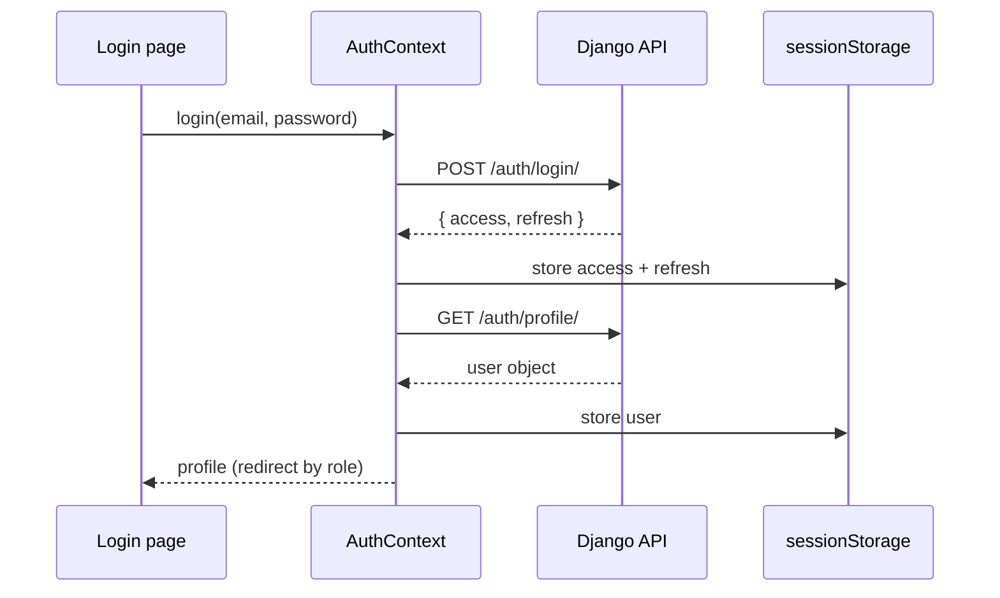

# Frontend Guide

The client is a React 19 single‑page application built with Vite and styled with Tailwind CSS 4. It lives in [`frontend/`](../frontend).

- [Stack](#stack)
- [Directory Layout](#directory-layout)
- [Routing Map](#routing-map)
- [Pages](#pages)
- [Components & Route Guards](#components--route-guards)
- [Authentication Flow](#authentication-flow)
- [API Layer](#api-layer)
- [Styling](#styling)
- [Build Outputs](#build-outputs)

---

## Stack

| Concern | Choice |
|---------|--------|
| UI library | React 19 |
| Build tool | Vite 8 |
| Routing | React Router 7 (`BrowserRouter`) |
| HTTP | Axios (single configured instance) |
| Styling | Tailwind CSS 4 (via `@tailwindcss/vite`) |
| State | React Context (`AuthContext`) + local component state |

---

## Directory Layout

```
frontend/src/
├── main.jsx              # React entry point
├── App.jsx              # Router + layout (Navbar / <Routes> / Footer)
├── index.css           # Tailwind import + theme tokens & component classes
├── api/
│   └── axios.js        # Axios instance, JWT request & refresh interceptors
├── context/
│   └── AuthContext.jsx # user state + login/register/updateProfile/logout
├── components/
│   ├── Navbar.jsx
│   ├── Footer.jsx
│   ├── ProtectedRoute.jsx
│   ├── AdminRoute.jsx
│   └── GuestRoute.jsx
└── pages/
    ├── Landing.jsx      DressList.jsx     RoomList.jsx
    ├── Login.jsx        DressDetail.jsx   RoomDetail.jsx
    ├── Register.jsx     BookingList.jsx   Dashboard.jsx
    ├── EditProfile.jsx  AdminPanel.jsx
```

---

## Routing Map

Defined in [`App.jsx`](../frontend/src/App.jsx). The whole tree is wrapped in `AuthProvider`, with a persistent `Navbar` and `Footer` around the routed `<main>`.

| Path | Page | Guard | Access |
|------|------|-------|--------|
| `/` | `Landing` | — | Public |
| `/login` | `Login` | `GuestRoute` | Logged‑out only |
| `/register` | `Register` | `GuestRoute` | Logged‑out only |
| `/rooms` | `RoomList` | — | Public |
| `/rooms/:id` | `RoomDetail` | — | Public (booking needs login) |
| `/dresses` | `DressList` | — | Public |
| `/dresses/:id` | `DressDetail` | — | Public (booking needs login) |
| `/dashboard` | `Dashboard` | `ProtectedRoute` | Authenticated |
| `/bookings` | `BookingList` | `ProtectedRoute` | Authenticated |
| `/profile` | `EditProfile` | `ProtectedRoute` | Authenticated |
| `/admin-panel` | `AdminPanel` | `AdminRoute` | Staff only |

---

## Pages

| Page | Responsibility |
|------|----------------|
| **Landing** | Marketing hero + grids of available rooms and dresses (`GET /rooms/?status=available`, `GET /dresses/?status=available`). |
| **Login** | Email + password form → `AuthContext.login()`. |
| **Register** | Account form (`username, email, password, phone, address`) → `AuthContext.register()`. |
| **RoomList** | Lists rooms with a status filter (`GET /rooms/?status=`). |
| **RoomDetail** | Room details + a booking form with a **live price estimate**; submits `POST /bookings/`. |
| **DressList** | Lists dresses with status **and** category filters (`GET /dresses/?status=&category=`). |
| **DressDetail** | Dress details + booking form with live estimate (deposit included). |
| **Dashboard** | Authenticated landing: quick stats (room/dress counts) and recent bookings. |
| **BookingList** | The user's bookings with status badges and a cancel action (`POST /bookings/:id/cancel/`). |
| **EditProfile** | Edit phone, address, and avatar via `AuthContext.updateProfile()` (multipart). |
| **AdminPanel** | Staff console with **Bookings / Rooms / Dresses** tabs; approve/reject bookings (`POST /bookings/:id/approve|reject/`) and manage inventory. |

---

## Components & Route Guards

The three guards in [`components/`](../frontend/src/components) all read `{ user, loading }` from `useAuth()` and show a spinner while the session is being resolved:

| Guard | Rule |
|-------|------|
| **`ProtectedRoute`** | No user → redirect to `/login`. |
| **`AdminRoute`** | No user → `/login`; signed‑in non‑staff → `/dashboard`; staff → render. |
| **`GuestRoute`** | Already signed in → redirect to `/admin-panel` (staff) or `/dashboard` (user); otherwise render. |

`Navbar` adapts its links to the auth state (e.g. showing the admin panel link only to staff); `Footer` is static.

---

## Authentication Flow

State lives in [`AuthContext.jsx`](../frontend/src/context/AuthContext.jsx).



Key behaviors:

- **Tokens are kept in `sessionStorage`**, so every browser tab has an independent session.
- On mount, if an `access_token` exists, `AuthContext` fetches `/auth/profile/` to restore the user; otherwise it starts logged‑out without a loading flash.
- `updateProfile()` sends a `multipart/form-data` `PATCH` so the avatar image can be included.
- `logout()` clears `sessionStorage` and redirects to `/login`.

---

## API Layer

A single Axios instance in [`api/axios.js`](../frontend/src/api/axios.js) centralizes all HTTP:

- **Base URL** `/api` — relative, so the Vite dev proxy (dev) or Nginx (prod) routes it to Django.
- **Request interceptor** attaches `Authorization: Bearer <access>` from `sessionStorage`.
- **Response interceptor** catches `401`, calls `/auth/token/refresh/` with the refresh token, stores the new access token, and **retries the original request once**. If refresh fails, it clears the session and redirects to `/login`.

Because everything imports this one instance, auth and refresh are handled uniformly across all pages.

---

## Styling

- **Tailwind CSS 4** is wired in through the Vite plugin (`@tailwindcss/vite`); there is no separate `tailwind.config` PostCSS pipeline.
- [`index.css`](../frontend/src/index.css) imports Tailwind and defines the bridal theme — an ivory/blush/champagne‑gold palette, serif display headings, reusable component classes (cards, buttons, badges), and the loading spinner used by the route guards.
- Layout uses a flex column (`min-h-screen`) so the footer stays at the bottom on short pages.

---

## Build Outputs

| Command | Output | Used by |
|---------|--------|---------|
| `npm run dev` | dev server on `:5173` (proxy to Django) | Local development |
| `npm run build` | `frontend/dist/` | `Dockerfile.react` (Compose mode) |
| `npm run build:django` | `static/react-assets/` + `frontend/templates/react-index.html` | Single‑server Django mode |

The Vite dev proxy ([`vite.config.js`](../frontend/vite.config.js)) forwards `/api`, `/admin`, and `/media` to `http://127.0.0.1:8000` so the SPA and API feel like one origin during development.

---

**See also:** [Architecture](ARCHITECTURE.md) · [API Reference](API_REFERENCE.md) · [Setup Guide](SETUP.md)
